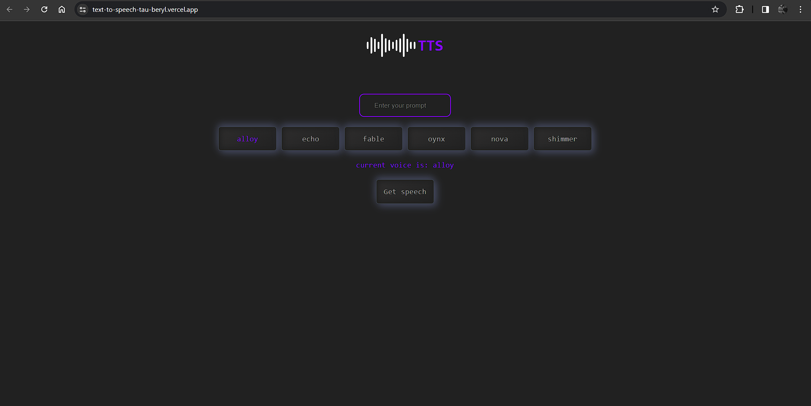

React Text-to-Speech App with Alloy API
This is a simple React application that utilizes the Alloy Text to Speech API to convert text into speech. The app provides 6 different voice options for customization.

Features
Convert text to speech using Alloy API.
Choose from 6 different voice options for the speech.
User-friendly interface.
Responsive design.




Installation
Clone the repository to your local machine:
```bash
git clone <repository-url>
```

Navigate into the project directory:
vbnet
```bash
cd react-text-to-speech-app
```
Install dependencies:
```bash
npm install
```
Start the development server:
sql
```bash
npm start
```
Open your browser and visit http://localhost:3000 to view the app.


Usage
Enter the text you want to convert to speech in the input field.
Choose a voice option.
Click the "Speak" button to listen to the generated speech.
Adjust volume, pitch, and rate if necessary using the sliders.

Voice Options
The app provides 6 different voice options for customization. These options are:

Alloy
Echo
Fable
Oynx
Nova
Shimmer


Contributing
Contributions are welcome! If you'd like to contribute to this project, please follow these steps:

Fork the project.
Create your feature branch (git checkout -b feature/my-new-feature).
Commit your changes (git commit -am 'Add some feature').
Push to the branch (git push origin feature/my-new-feature).
Create a new Pull Request.
License
This project is licensed under the MIT License - see the LICENSE file for details.

